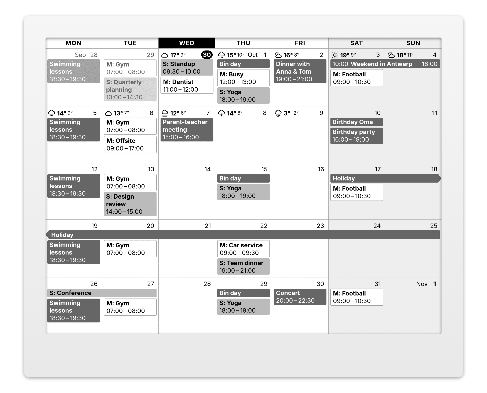
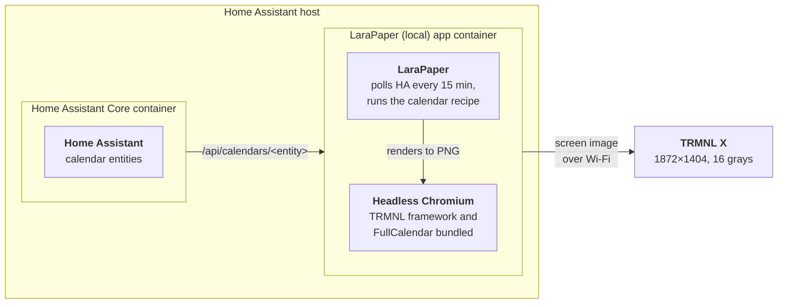
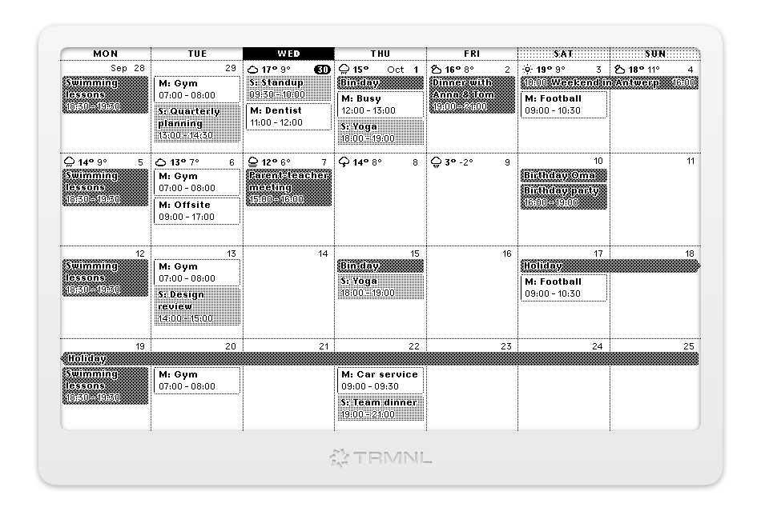

# Rolling Month Calendar for TRMNL

A rolling-month calendar for [TRMNL](https://trmnl.com) e-ink displays: the current week
and the weeks after it in one grid, with several calendars side by side, a color and a
prefix per calendar, and half and quadrant views for mashups. Made for the
**TRMNL X**, and it works on the original TRMNL too.



There are two ways to use it. Pick the one that matches how your TRMNL is set up:

- **[On TRMNL.com](#on-trmnlcom)**: your device uses TRMNL's own servers. Install the
  recipe and pick the calendar plugins you already connected on trmnl.com (Google,
  Outlook, Apple, CalDAV…). Nothing to host. If your calendars are in Home Assistant
  instead, and it is reachable from the internet, there is a
  [Home Assistant edition](#on-trmnlcom-with-home-assistant).
- **[Self-hosted with LaraPaper](#self-hosted-with-larapaper)**: your device talks to
  [LaraPaper](https://github.com/usetrmnl/larapaper), a TRMNL server you run yourself,
  for example as a Home Assistant app. The calendar then reads **ICS feeds** or **Home
  Assistant** calendar entities, and everything stays on your network.

The [settings](#settings) are the same on both, apart from where the events come from.
The rest of this README after [Settings](#settings) is about how the recipe is built,
for anyone who wants to change it.

## On TRMNL.com

1. **Connect your calendars as TRMNL calendar plugins** on trmnl.com, if you haven't
   already (Google Calendar, Outlook, Apple, CalDAV…). In each one's settings:
   - set the layout to **Rolling Month**; with another layout it only shares the events
     of its own, shorter view;
   - keep it in a playlist, or its events stop refreshing. It doesn't have to show:
     hiding it in the playlist is fine.
2. **Install the recipe**: find **Rolling Month Calendar (TRMNL calendars)** among
   TRMNL's recipes and install it.
3. **Pick your calendars** in its **Calendar** dropdowns, up to four. The dropdowns list
   all your plugins, so choose the calendar ones. Set the other [settings](#settings)
   as you like.
4. **Add it to your playlist.**

For the weather next to the day numbers, pick a weather plugin in its **Weather**
dropdown (see [Weather](#weather)).

Updates arrive by themselves: every release of this repository updates the recipe on
TRMNL.com.

### On TRMNL.com with Home Assistant

**Rolling Month Calendar (Home Assistant)** is the same calendar for Home Assistant
calendar entities (Local Calendar, Google, CalDAV, iCloud…), on TRMNL.com. TRMNL's
servers fetch the events from Home Assistant on every refresh, so Home Assistant has to
be reachable from the internet: through [Home Assistant
Cloud](https://www.nabucasa.com/config/remote/) (its remote URL, like
`https://abcdefgh.ui.nabu.casa`) or your own [remote
access](https://www.home-assistant.io/docs/configuration/remote/) address. If it isn't,
or you'd rather keep it that way, run [LaraPaper](#self-hosted-with-larapaper) at home
instead.

1. **Make a long-lived access token** in Home Assistant: your profile → **Security** →
   **Long-lived access tokens** → Create. A token can do anything its user can, so
   preferably make a separate user for TRMNL that isn't an administrator (Settings →
   People → Users), log in as that user and create the token there.
2. **Install the recipe**: find **Rolling Month Calendar (Home Assistant)** among TRMNL's
   recipes and install it.
3. **Fill in** your Home Assistant URL (without a trailing slash), the token and your
   calendar entity IDs (Settings → Devices & services → Entities, search for
   `calendar.`). Set the other [settings](#settings) as you like.
4. **Add it to your playlist.**

For the weather next to the day numbers, fill in **Home Assistant weather entity** (see
[Weather](#weather)).

To try it before connecting your own Home Assistant, point it at the sample calendars in
this repository instead ([how](plugin/trmnl-com-polling/README.md#trying-it-without-your-own-home-assistant)).

## Self-hosted with LaraPaper

This repository also has a Home Assistant app, **LaraPaper (local)**, that runs LaraPaper
with everything the calendar needs built in, so rendering a screen needs no internet
access. LaraPaper can also run with Docker Compose on any machine.



<sub>With Docker Compose instead of the app, the LaraPaper container runs on any machine that can reach Home Assistant.</sub>

### 1. Run LaraPaper

**As a Home Assistant app (recommended).** This repository is an app repository. Go to
Settings → Apps → store → ⋮ → Repositories, add
`https://github.com/BartSchuurmans/trmnl-rolling-month-calendar`, and install
**LaraPaper (local)**. It bundles the TRMNL framework and FullCalendar, so rendering
needs no internet access, and it reads your calendars with its own Home Assistant
access, so you don't need an access token. Its web UI opens inside Home Assistant, so
you can reach it wherever you reach Home Assistant. Setup steps are in
[larapaper/DOCS.md](larapaper/DOCS.md).

**Or with Docker Compose** on any machine:

```sh
cat > .env <<EOF
APP_KEY=base64:$(openssl rand -base64 32)
APP_URL=http://<server-ip>:4567
EOF
docker compose up -d
```

Open `http://<server-ip>:4567` and register. Set your time zone in your user
settings; the calendar uses it unless you set one on the plugin.

### 2. Point the TRMNL X at it

A new TRMNL X starts in Wi-Fi pairing mode. To get back to it on one that is already set
up, hold the left and right ends of the touch bar until the screen flashes (the X has no
button on the back). Connect to the **TRMNL** Wi-Fi network it opens, tap **Advanced** →
**Custom Server** → **Yes** and enter `http://<server-ip>:4567`, without a trailing
slash. Then go **Back to Wi-Fi**, pick your network and **Connect**.

With the **Auto-Join** toggle in LaraPaper's header switched on (it then reads **Auto-Join
Permitted**; only the first registered user sees it), the device shows up by itself.
Check that its device model is **TRMNL X**. The device then shows "Please visit
trmnl.com/start with Friendly ID … to finish setup". The firmware always shows that text
after pairing, also with a custom server, so ignore it: the device is paired once it is
listed in LaraPaper, and it shows your playlist from its next refresh (tap the middle of
the touch bar to refresh now).

### 3. Find your calendars

**ICS feeds.** Most calendar services publish a private feed link (read-only, and
anyone with the link can read the calendar, so keep it private):

- Google Calendar: calendar settings → **Integrate calendar** → **Secret address in
  iCal format**
- iCloud: Calendar app → share the calendar → **Public Calendar** → copy the
  `webcal://` link
- Outlook.com / Microsoft 365: Settings → Calendar → **Shared calendars** → **Publish a
  calendar** → the ICS link
- Fastmail, Nextcloud and most CalDAV servers have a similar "subscribe" or "export"
  link

**Home Assistant.** Find your calendar entity IDs under Settings → Devices & services →
Entities (filter on `calendar.`). Any calendar integration works (Local Calendar,
Google, CalDAV, iCloud…).

**Docker Compose only:** LaraPaper needs a token to read Home Assistant. HA → your profile →
**Security** → **Long-lived access tokens** → Create. Check it from the LaraPaper host:

```sh
curl -H "Authorization: Bearer $TOKEN" \
  "http://homeassistant.local:8123/api/calendars/calendar.family?start=2026-09-21&end=2026-11-10"
```

### 4. Install the recipe

LaraPaper → **Plugins** → add menu → **Import from OSS Catalog** → **Install** on
**Rolling Month Calendar**. Then
open the settings of the **Rolling Month Calendar** recipe and fill in either:

- **ICS feed URLs**, one per calendar. When these are set, the Home Assistant fields are
  not used. Or:
- **Home Assistant calendar entities**, e.g. `calendar.family`, `calendar.work`. With
  Docker Compose also **Home Assistant URL**, e.g. `http://homeassistant.local:8123`
  (must be reachable from the LaraPaper container), and **Access token**. With the
  Home Assistant app, leave the URL at its default `http://127.0.0.1:8124` and the
  token empty: that is the app's own access to Home Assistant.

With the Home Assistant app you can also fill in **Home Assistant weather entity**, e.g.
`weather.forecast_home`, for each day's forecast next to its day number (see
[Weather](#weather)).

The calendar is made to run to the screen's edges, as it does on TRMNL.com. LaraPaper
0.44.0 and later take that from the recipe; on an older LaraPaper, tick **Remove bleed
margin?** under **Screen Settings**.

Add the recipe to the device's playlist (**Add to Playlist** on the recipe page).

**Updating:** installing from the catalog again adds a second copy. To update in place
and keep your settings, download
[`rolling-month-calendar.zip`](https://github.com/BartSchuurmans/trmnl-rolling-month-calendar/releases/latest/download/rolling-month-calendar.zip)
from the latest release and import it with **Plugins** → add menu → **Import Recipe
Archive**. The recipe keeps the same `id` (`settings.yml`), so LaraPaper replaces the
installed copy. After changing anything under `plugin/src`, build the ZIP with
`./scripts/build-zip.sh` (→ `dist/rolling-month-calendar.zip`) and import that the same
way.

### ICS feeds

LaraPaper fetches each feed on every refresh and parses it itself: recurring events are
expanded and times are converted from the feed's time zones. It keeps only events from
7 days back to 45 days ahead (30 before LaraPaper 0.44.0), so with ICS feeds the grid
ends at the last whole week before that: 6 weeks, or on an older LaraPaper usually 4
and sometimes 5. A later day would otherwise look free while its events are simply not
in the data. Home Assistant is asked for 6 weeks ahead and has no such limit.

A `webcal://` link is fetched over `https://`. The Home Assistant token is never sent
to the feeds.

### Weather

Each day from today on can get its daily forecast left of its day number: an icon and
the high, or the high and low with **Weather temperatures**. Where the line runs out of
room (next to a week number or a month name, say) the low is left out, then the high,
and narrow views (half and quadrant mashups) show only the icon.

**On TRMNL.com with TRMNL calendars**, pick a weather plugin in the **Weather** dropdown,
and keep that plugin in a playlist (hidden is fine) so it keeps refreshing:

- TRMNL's own **Weather** plugin: today and tomorrow only, as that plugin shares no more.
- The **Daily Weather** recipe (by Daniel Sitnik): about a week from
  [Open-Meteo](https://open-meteo.com), for the latitude and longitude you give it, no
  account or key.

Any other recipe that polls Open-Meteo's daily `weather_code`, `temperature_2m_max` and
`temperature_2m_min` works as well.

**On TRMNL.com with Home Assistant**, set **Home Assistant weather entity**. The recipe's
serverless function on TRMNL.com asks your Home Assistant for that entity's forecast,
with the same token as the calendars.

**With LaraPaper**, it takes the LaraPaper (local) app: set **Home Assistant weather
entity**, and the forecast comes from that entity. It works with ICS feeds as well as
with Home Assistant calendars.

Use Home Assistant's [Open-Meteo](https://www.home-assistant.io/integrations/open_meteo/)
integration (free, no key) rather than Met.no, the one Home Assistant sets up as
`weather.forecast_home`. Met.no's forecast for today covers only the hours still ahead,
so by the evening today's high is about the current temperature. Open-Meteo's covers
the whole day. Its entity is named after the zone it forecasts for, e.g. `weather.home`
for the Home zone.

Home Assistant gives forecasts only to a `weather.get_forecasts` service call (a POST),
and a recipe can only poll with GET. The app's proxy on `http://127.0.0.1:8124` turns
`GET /api/weather/<weather entity>` into that one call (`type: daily`), so the recipe
fetches the forecast from **Home Assistant URL** at its default. It doesn't work with
a Home Assistant URL of your own (Docker Compose).

## Settings

Where the events and the weather come from is the only difference between the two:
TRMNL.com has the **Calendar** and **Weather** dropdowns, its Home Assistant edition the
**Home Assistant** fields, LaraPaper the **ICS feed URLs** or **Home
Assistant** fields (see the setup above). Everything else is the same.

On TRMNL.com the form folds them into these groups (click a group to open it), below
the calendar fields; LaraPaper shows them as one list in this order. On/off settings are
toggles.

#### Calendars

| Setting | Default | Notes |
|---|---|---|
| Calendar prefixes | – | Text shown before each event title, per calendar (e.g. `W:`) |
| Calendar colors | – | Event background per calendar: a TRMNL color name (`black`, `gray-10` … `gray-75`, `red`, `blue-40`, …) or a hex color |

#### Weather

| Setting | Default | Notes |
|---|---|---|
| Weather (*TRMNL.com*) | – | TRMNL's Weather plugin or the Daily Weather recipe, see [Weather](#weather) |
| Home Assistant weather entity (*LaraPaper*) | – | With the Home Assistant app: the daily forecast next to each day number, see [Weather](#weather) |
| Weather temperatures | High | `High and low` adds the low where it fits |

#### Grid

| Setting | Default | Notes |
|---|---|---|
| Week starts on | Monday | |
| Advance | Weekly | `Daily` starts the grid at today instead of the start of the week |
| Busy weeks | Show fewer weeks | What happens when the weeks don't all fit, see below |
| Show week numbers | off | |
| Highlight today | on | Today's weekday is inverted in the header row and its day number gets a black pill |
| Shade weekends | on | |
| Show title bar | off | The framework's title bar, with the recipe name and the visible date range |

#### Events

| Setting | Default | Notes |
|---|---|---|
| Time format | 24 hour | |
| Show event times / end times | on / on | Times go on their own line below the title. End times only show with event times on |
| Show past events | on | Earlier days of the current week |
| Fade past events | on | Events that are over are drawn faded. Greyscale screens (TRMNL X) only |
| Ignore events containing / titled exactly | – | Hide events by title (and, for "containing", description) |

#### Language and time zone

| Setting | Default | Notes |
|---|---|---|
| Time zone | Your account's time zone | Events are converted to this zone before rendering |
| Locale | `en` | Day/month names, e.g. `nl`, `de` |

The on/off settings were Yes/No dropdowns up to v2.1.0. The calendar still reads values
saved back then, but LaraPaper's form shows a saved "No" as ticked, and saving the form
then turns it on: after updating, check the toggles once.

The grid shows as many whole weeks (up to 6) as fit, and with ICS feeds no more than
the feeds cover (see [ICS feeds](#ics-feeds)): busy weeks make rows taller, so
fewer fit. With **Busy weeks** set to `Show fewer weeks` it shows only the weeks that
fit, so every event stays visible even if that is only a week or two. `Show "+N more"`
keeps at least 3 weeks and ends a day that doesn't fit with "+N more". (TRMNL's built-in
calendar keeps at least 4 weeks and cuts a very busy 4th week off at the bottom.)

On 1-bit and 2-bit screens greys become the framework's dot patterns. Weekends are
shaded in the header row only and event times are solid black, because the patterns
make the pixel fonts on top of them hard to read.

<sub>The same calendar on a 1-bit (left) and a 2-bit (right) screen.</sub><br>
 

### Multiple calendars

Pick several **Calendar** dropdowns on TRMNL.com, or list several feeds under **ICS feed
URLs** or several entities under **Home Assistant calendar entities** on LaraPaper.
**Calendar prefixes** and **Calendar colors** are matched to them by position: the first
prefix/color goes with the first calendar, and so on. Empty entries are skipped, so use
`-` to hold the place of a calendar that should have none. For example, with these
settings:

| Setting | Entries |
|---|---|
| Calendars | Family, Mark, Sara |
| Calendar prefixes | `-`, `M:`, `S:` |
| Calendar colors | `gray-35`, `white`, `gray-60` |

shared family events get no prefix and a `gray-35` fill, Mark's events get `M:` and a
`white` fill, and Sara's get `S:` and a `gray-60` fill. That is what the screenshots above
show, with a weather forecast and **Weather temperatures** on `High and low` (see
[Weather](#weather)).

- **Prefix**: shown before the title, followed by a space (`S: Standup`).
- **Color**: fills every event of that calendar, timed ones included, instead of a dot.
  Text turns black or white depending on how light the color is.
  - Color names use the framework's classes: solid greys on the TRMNL X (hues fall back
    to a grey), dither patterns with outlined text on 1-/2-bit screens, and real
    colors on color panels.
  - Hex colors are painted as-is. A 1-bit screen snaps them to black or white.
  - `white` (or `#fff`) gets a thin grey outline, dotted on 1-/2-bit screens, like the
    grid lines, so its events don't vanish on a white day. Where such an event goes on
    in another week, that side of the outline stays open.
- Events without a calendar color get a grey bar on the left with a bold title, and
  timed events the time in grey below it (the built-in calendar's look). Single-day
  all-day events are drawn the same way; multi-day events are a light grey band across
  their days.
- A band that goes on in the previous or next week (or before or after the grid) has a
  pointed end on that side. A timed event over several weeks shows when it starts in its
  first week (`14:00 –`), when it ends in its last (`– 11:00`), and no time in between.
- Titles wrap over at most two lines, then end in an ellipsis, for every kind of event.

## Differences from upstream

The recipe is a fork of TRMNL's native calendar plugin
([usetrmnl/plugins `lib/calendars`](https://github.com/usetrmnl/plugins/tree/master/lib/calendars)),
`rolling_month` layout only. The FullCalendar view, the 4–6 week fitting and the event
filtering work as upstream. What changed:

- **Several sources instead of one Google Calendar.** On TRMNL.com, up to four of your
  TRMNL calendar plugins in one grid. On LaraPaper, any calendar's ICS feed link, which
  LaraPaper fetches and parses, or HA's `/api/calendars/<entity>` endpoint, so any HA
  calendar integration works. All are turned into FullCalendar events in the browser,
  where upstream does it server-side.
- **Liquid recipe instead of ERB.** Runs on TRMNL.com and LaraPaper; the settings are
  custom fields.
- **Open-source parts only.** The public FullCalendar 7.1 build instead of TRMNL's
  private one, and styles rebuilt from TRMNL framework classes, because upstream's
  calendar stylesheets aren't published. The look matches upstream's month preview.
- **Per-calendar colors and prefixes** replace Google's calendar and event colors.
- **Half and quadrant views for mashups.** The top or bottom half keeps the full width
  and shows the weeks that fit (usually two); the left or right half is the full grid at
  half the width, with start times only and tighter spacing. A quadrant is narrow like
  that and usually shows one week.
  The RSVP filter is gone, since HA doesn't expose attendees.
- **Explicit time zone handling**: events are converted to the configured zone, so the
  result doesn't depend on the renderer's system zone.
- **Rendering fixes and additions**: greys adapted to 1-/2-bit screens, and a notice when a
  calendar fails to load.
- **Removed**: the time-grid helpers and FullCalendar's own header toolbar (the
  framework's title bar is used instead).

[UPSTREAM.md](UPSTREAM.md) maps each upstream file to its counterpart here and lists
the changes in detail.

## What's in this repository

- **The calendar recipe** (`plugin/src/`): the markup, in trmnlp format, that polls ICS
  feeds or Home Assistant's calendar API and draws the events with FullCalendar inside
  the TRMNL framework. LaraPaper installs it from the
  [TRMNL recipe catalog](https://bnussbau.github.io/trmnl-recipe-catalog/); each release
  also has it as `rolling-month-calendar.zip`.
- **The TRMNL.com Plugin Merge recipe** (`plugin/trmnl-com-merge/`): the same markup with the Plugin Merge
  strategy, built from `plugin/src` and uploaded to TRMNL.com on each release. See
  [plugin/README.md](plugin/README.md).
- **The TRMNL.com Home Assistant recipe** (`plugin/trmnl-com-polling/`): the same markup polling
  Home Assistant from TRMNL.com, plus a serverless function (`transform.js`) that fetches
  the weather forecast, built and released the same way.
- **LaraPaper (local)** (`larapaper/`, `repository.yaml`): a Home Assistant app that runs
  the official LaraPaper image with the TRMNL framework, its fonts and FullCalendar built
  in, so rendering a screen needs no internet access. See
  [larapaper/DOCS.md](larapaper/DOCS.md).
- **A local preview** (`preview/`): renders the recipe to a PNG at the device's
  resolution and grey levels, from sample, random or live Home Assistant data. CI uses it
  to check every change.

| Path | What |
|---|---|
| `plugin/src/settings.yml` | Recipe settings: polling URL, auth header, custom fields |
| `plugin/src/full.liquid`, `half_horizontal.liquid`, `half_vertical.liquid`, `quadrant.liquid` | The views: each prints the calendar from `shared.liquid` |
| `plugin/src/shared.liquid` | CSS + JS (fork of `_common.html.erb` + the ICS / HA / TRMNL plugin event mapping) and the markup (fork of `_full_month.html.erb`) |
| `plugin/trmnl-com-merge/` | The TRMNL.com Plugin Merge variant: its settings and `merge.liquid` |
| `plugin/trmnl-com-polling/` | The TRMNL.com polling variant (Home Assistant): its settings and serverless function (`transform.js`) |
| `preview/` | Local renderer and CI render checks |
| `preview/sample-data.mjs`, `docs/sample-ics/`, `docs/sample-ha/`, `preview/sample-server/` | The sample calendars: six weeks that repeat, drawn in the screenshots and published as ICS feeds for TRMNL.com's marketplace preview and as a stand-in Home Assistant (static files, and a Cloudflare Worker that adds the weather) |
| `scripts/build-zip.sh` | Packages `plugin/src` for import into LaraPaper (attached to each release) |
| `scripts/build-variant.sh` | Builds the variants, such as the TRMNL.com recipe |
| `larapaper/`, `repository.yaml` | The LaraPaper (local) Home Assistant app |
| `docker-compose.yml` | Plain LaraPaper, for running outside Home Assistant |

## TRMNL framework

The recipe renders inside the [TRMNL framework](https://github.com/usetrmnl/trmnl-framework)
(`framework_version: 3.3.1` in `settings.yml`, LaraPaper's default). The plugin uses it for:

- **Text**: `text--small` / `text--base` on FullCalendar's elements. That's Inter at the
  device's scale on the TRMNL X, and TRMNL pixel fonts on low-density 1-bit screens.
- **Greys**: `bg--gray-75` for weekends and `text--muted` for past days. Solid on 4-bit,
  dither patterns on 1-/2-bit.
- **Layout**: `layout` → optional `title_bar` (the `view` wrapper comes from TRMNL or LaraPaper), with spacing from `--ui-scale`.

The calendar grid itself (borders, cells, event blocks) is custom CSS, as upstream,
because the framework has no calendar component: a small FullCalendar 7 theme ("Mono" in
`shared.liquid`) whose colours sit in a cascade layer below the framework's utilities, so
the framework classes above win wherever both apply.

On the TRMNL X, LaraPaper renders at 1872×1404 with `screen--v2 screen--scale-xxlarge`.
The framework lays that out at 1040×780 and scales the screen by 1.8 with a CSS
`transform`, with a 1.5× UI scale on top. FullCalendar 7 lays out correctly under that
transform.

## Local preview

```sh
cd preview && npm install
node render.mjs                                   # sample events → out/preview.png
node render.mjs --set display_event_end=false --set locale=nl
HA_URL=http://homeassistant.local:8123 HA_TOKEN=... \
  HA_CALENDARS=calendar.family,calendar.work node render.mjs   # your real calendars
```

Options: `--set key=value` (any custom field), `--tz Europe/Amsterdam`,
`--device og` / `og2` (800×480, 1-bit / 2-bit), `--raw` (skip the grey-level reduction), `--data payload.json`,
`--ics` (hand the events over as parsed ICS feeds, as LaraPaper does), `--merge` (as TRMNL.com's Plugin Merge dropdowns),
`--merge-weather trmnl|open-meteo` (the same, with TRMNL's Weather plugin or an Open-Meteo recipe in the Weather dropdown), `--out file.png`. It needs a Chromium;
set `CHROMIUM_PATH` if Playwright can't find one.

The preview uses the same window size, screen classes and framework version as
LaraPaper. It loads the framework from trmnl.com; to work offline, point
`FRAMEWORK_DIR` at the `public/` folder of a
[trmnl-framework](https://github.com/usetrmnl/trmnl-framework) checkout at the matching
tag (`git checkout v3.3.1`). Templates are rendered with [liquidjs](https://liquidjs.com)
instead of LaraPaper's PHP Liquid, so small differences are possible.

## CI

- **Render** (`.github/workflows/render.yml`, on changes to the recipe or preview): runs
  `preview/ci.sh`. That renders sample and random calendars on the TRMNL X and OG with
  the framework files pinned in `larapaper/assets.txt`, and renders once through
  LaraPaper's PHP Liquid engine (`preview/php/render.php`, which also checks the polling
  URLs and headers for Home Assistant and ICS feeds), and through trmnlp
  (TRMNL's own Ruby Liquid, via Docker). The sample and some random calendars are also
  rendered as ICS feeds, in the shape LaraPaper parses them into, and the sample as TRMNL
  calendar plugins' data, with both kinds of weather plugin. It
  fails on template errors, JavaScript errors and renders that
  don't finish. The screenshots are attached to the run as the `renders` artifact. The
  TRMNL.com recipes are also tested with `trmnlp test` (their polling, serverless function
  and views on TRMNL's devices, against fake APIs); its report is the `trmnlp-test-report`
  artifact.
- **App** (`.github/workflows/app.yml`, on changes to `larapaper/` or the recipe): lints
  the app, builds the image (amd64) and starts it with a fake `/data`. It checks that
  LaraPaper comes up, serves the bundled framework, fonts and FullCalendar, applied the
  app options, and keeps its key and database across a restart. On main it then
  publishes the image (amd64 and aarch64) to `ghcr.io/bartschuurmans/larapaper-local`
  when the app version is new; Home Assistant installs the app from there.
- **End-to-end** (`e2e/run.mjs`, part of the App workflow): imports the recipe ZIP into
  that LaraPaper, points it at a fake Home Assistant (`e2e/fake-ha.mjs`) and fetches
  the screen like a TRMNL X does (`GET /api/display`). It checks the polled URLs and
  token, the stored payload for two, one and zero-event calendars and for two ICS feeds
  it serves (recurring and all-day events, no token sent), the weather forecast call the
  app's proxy makes, that the recipe
  rendered rather than LaraPaper's error screen, the PNG size, and that events show up
  on the screen. `e2e/ingress.mjs` then logs in to the web UI through a fake Home
  Assistant ingress and checks that the dashboard, the recipe preview and a render load
  everything under the ingress path. The screens are attached as the `e2e-screens`
  artifact.
- **TRMNL.com** (`.github/workflows/trmnl-com.yml`): on each release, uploads the
  TRMNL.com recipes and checks that TRMNL.com matches the build; weekly, only compares
  them. See [plugin/README.md](plugin/README.md).

To run the render checks locally, set up `FRAMEWORK_DIR` as in the workflow, run
`composer install` in `preview/php`, then run `sh preview/ci.sh`.

## Notes

- For Home Assistant, the polling URL fetches 7 days back to 43 days ahead, enough for
  the current week plus 6 weeks. The dates are computed from the timestamp of today's
  local midnight (`"now" | date: "%Y-%m-%d" | date: "%s" | minus: 561600`), which
  LaraPaper's PHP Liquid and the Ruby Liquid of TRMNL's own servers both read the same
  way.
- The recipe loads FullCalendar from `/rolling-month-calendar/...`, which the LaraPaper (local)
  app serves, and falls back to jsDelivr on any other server (TRMNL.com loads it from
  jsDelivr straight away). With plain LaraPaper, rendering also loads the TRMNL framework
  from trmnl.com, so the container needs internet access. The app avoids both. How: screens render from a
  temporary `file://` page, so root-relative paths resolve to files in the image, and to
  nginx in the browser preview.
- Like LaraPaper, the preview reduces the screenshot to the device's grey levels. 4-bit
  is always dithered. 1-bit and 2-bit are dithered only when the page contains
  ``, which the recipe doesn't add.
- The token only goes into the request header. It is not written into the rendered page.

## License

MIT, see [LICENSE](LICENSE), for this project's own code. The recipe is forked from
TRMNL's source-available native calendar plugin, and the Home Assistant app bundles the
TRMNL framework, its fonts and FullCalendar; see
[THIRD_PARTY_NOTICES.md](THIRD_PARTY_NOTICES.md) for their terms.
